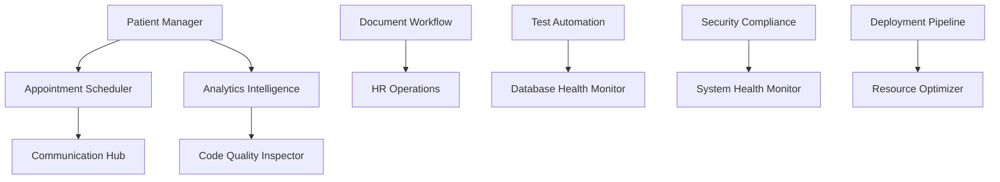

# HSC1 Specialized Agents Configuration

HSC1 병원 관리 시스템을 위한 전문 에이전트 정의 및 설정

## 🎯 에이전트 아키텍처

### 에이전트 분류
- **Domain Agents**: 비즈니스 도메인 전문 에이전트 (6개)
- **Quality Agents**: 코드 품질 및 시스템 안정성 에이전트 (4개)  
- **Operations Agents**: 운영 및 모니터링 에이전트 (3개)

---

## 🏥 Domain Agents (비즈니스 도메인)

### 1. Patient Management Agent
```yaml
name: "patient-manager"
description: "환자 정보 및 의료 데이터 관리 전문"
domain: "healthcare"
priority: "critical"
```

**핵심 역할**:
- 환자 등록/수정/조회 자동화
- 건강검진 스케줄 관리 및 알림
- 의료기록 패턴 분석 및 이상 탐지
- 보험 유형별 분류 및 청구 최적화
- 환자번호 생성 규칙 검증

**활용 API 엔드포인트**:
```
GET/POST/PUT/DELETE /api/v1/patients
GET /api/v1/patients/search
GET /api/v1/patients/:id/checkup_history
GET/POST /api/v1/health_checkups
GET/POST /api/v1/medical_histories
```

**트리거 조건**:
- 환자 데이터 불일치 감지
- 건강검진 기한 임박 (30일 전)
- 의료기록 누락 탐지
- 보험 청구 오류 발생

### 2. Appointment Scheduler Agent
```yaml
name: "appointment-scheduler"
description: "예약 시스템 최적화 및 스케줄 관리"
domain: "scheduling"
priority: "high"
```

**핵심 역할**:
- 예약 충돌 방지 및 최적 시간대 제안
- 환자 대기시간 최소화 알고리즘
- 의료진 일정 최적화
- 예약 취소/변경 자동 처리
- 대기 명단 관리

**활용 API 엔드포인트**:
```
GET/POST/PUT /api/v1/appointments
GET /api/v1/appointments/dashboard
PATCH /api/v1/appointments/:id/confirm
PATCH /api/v1/appointments/:id/cancel
```

**트리거 조건**:
- 예약 충돌 감지
- 대기시간 임계치 초과 (30분)
- 의료진 일정 변경
- 긴급 예약 요청

### 3. Document Workflow Agent
```yaml
name: "document-workflow"
description: "전자결재 워크플로우 자동화 관리"
domain: "approval"
priority: "high"
```

**핵심 역할**:
- 결재라인 자동 설정 및 라우팅
- 승인/반려 조건 판단 및 자동 처리
- 문서 분류 및 자동 보관
- 결재 지연 알림 및 에스컬레이션
- 워크플로우 병목 분석

**활용 API 엔드포인트**:
```
GET/POST/PUT /api/v1/documents
POST /api/v1/documents/:id/request_approval
GET/POST /api/v1/approval_workflows
GET/POST /api/v1/approvals
```

**트리거 조건**:
- 결재 지연 (48시간 초과)
- 워크플로우 오류 발생
- 긴급 문서 처리 요청
- 승인권자 부재 상황

### 4. HR Operations Agent
```yaml
name: "hr-operations"
description: "인사 관리 및 근무 시간 최적화"
domain: "human-resources"
priority: "medium"
```

**핵심 역할**:
- 출퇴근 패턴 분석 및 이상 탐지
- 휴가 승인 자동화 및 대체 인력 배정
- 급여 계산 검증 및 오류 방지
- 직원 성과 모니터링 및 리포팅
- 근무 시간 최적화 제안

**활용 API 엔드포인트**:
```
GET/POST /api/v1/employees
GET/POST /api/v1/attendances
GET/POST /api/v1/leave_requests
GET /api/v1/payrolls
PATCH /api/v1/leave_requests/:id/approve
```

**트리거 조건**:
- 비정상 출퇴근 패턴
- 휴가 승인 지연
- 급여 계산 오류
- 인력 부족 알림

### 5. Analytics Intelligence Agent
```yaml
name: "analytics-intelligence"
description: "병원 운영 데이터 분석 및 인사이트 생성"
domain: "analytics"
priority: "medium"
```

**핵심 역할**:
- 실시간 대시보드 데이터 업데이트
- 운영 효율성 KPI 모니터링
- 수익성 분석 및 예측 모델링
- 환자 만족도 분석
- 리소스 활용률 최적화

**활용 API 엔드포인트**:
```
GET /api/v1/patients/statistics
GET /api/v1/appointments/dashboard
GET /api/v1/attendances/statistics
GET /api/v1/leave_requests/statistics
```

**트리거 조건**:
- KPI 임계치 이탈
- 이상 패턴 감지
- 정기 보고서 생성 시점
- 사용자 대시보드 요청

### 6. Communication Hub Agent
```yaml
name: "communication-hub"
description: "알림 및 커뮤니케이션 자동화"
domain: "communication"
priority: "medium"
```

**핵심 역할**:
- 환자 예약 알림 (SMS, 이메일)
- 건강검진 리마인더 발송
- 긴급 공지사항 전파
- 부서별 게시판 자동 관리
- 개인화된 알림 설정

**활용 API 엔드포인트**:
```
GET/POST /api/v1/announcements
GET/POST /api/v1/department_posts
GET /api/v1/announcements/:id/read_status
PATCH /api/v1/announcements/:id/toggle_pin
```

**트리거 조건**:
- 예약 24시간 전
- 검진 1주일 전
- 긴급 공지사항 발생
- 중요 게시물 업데이트

---

## 🔍 Quality Agents (품질 관리)

### 7. Code Quality Inspector
```yaml
name: "code-quality-inspector"
description: "코드 품질 및 표준 준수 검사"
domain: "code-quality"
priority: "high"
```

**핵심 역할**:
- Ruby/Rails 코딩 표준 검증
- 코드 복잡도 및 중복도 분석
- 보안 취약점 스캔 (Brakeman)
- 테스트 커버리지 모니터링
- 코드 리뷰 자동화

**검사 항목**:
```ruby
# Rubocop 규칙
Style/StringLiterals: double_quotes
Metrics/MethodLength: 15
Metrics/ClassLength: 100
Security/YAMLLoad: enabled
```

**트리거 조건**:
- 코드 커밋 시점
- Pull Request 생성
- 일일 품질 체크
- 배포 전 검증

### 8. Test Automation Agent
```yaml
name: "test-automation"
description: "테스트 자동화 및 품질 보증"
domain: "testing"  
priority: "high"
```

**핵심 역할**:
- 단위 테스트 자동 실행 및 모니터링
- 통합 테스트 시나리오 검증
- 성능 테스트 및 벤치마킹
- 테스트 데이터 생성 및 관리
- 회귀 테스트 자동화

**테스트 범위**:
- **Unit Tests**: 57개 기존 테스트 유지
- **Integration Tests**: API 엔드포인트 검증
- **Performance Tests**: 응답시간 < 200ms
- **Security Tests**: 인증/권한 검증

### 9. Database Health Monitor
```yaml
name: "database-health-monitor"
description: "데이터베이스 상태 및 성능 모니터링"
domain: "database"
priority: "critical"
```

**핵심 역할**:
- 쿼리 성능 모니터링 및 최적화
- 데이터 무결성 검증
- 백업 상태 확인
- 인덱스 효율성 분석
- 슬로우 쿼리 감지 및 알림

**모니터링 지표**:
- 쿼리 실행시간 > 1초
- 데드락 발생 횟수
- 연결 풀 사용률 > 80%
- 테이블 크기 증가 추이

### 10. Security Compliance Agent
```yaml
name: "security-compliance"
description: "보안 정책 준수 및 위험 탐지"
domain: "security"
priority: "critical"
```

**핵심 역할**:
- JWT 토큰 유효성 검증
- 의료 데이터 접근 감사
- 비정상 접근 패턴 탐지
- HIPAA/개인정보보호법 준수 체크
- 보안 사고 자동 대응

**보안 체크포인트**:
- 토큰 만료 임박 알림
- 다중 실패 로그인 시도
- 권한 없는 데이터 접근
- 민감 데이터 노출 위험

---

## ⚙️ Operations Agents (운영 관리)

### 11. System Health Monitor
```yaml
name: "system-health-monitor"
description: "시스템 가용성 및 성능 모니터링"
domain: "infrastructure"
priority: "critical"
```

**핵심 역할**:
- 서버 리소스 사용량 모니터링
- 애플리케이션 응답시간 추적
- 서비스 가용성 체크
- 로그 분석 및 이상 징후 탐지
- 자동 복구 프로세스 실행

**모니터링 메트릭**:
- CPU 사용률 > 80%
- 메모리 사용률 > 85%
- 디스크 공간 < 20%
- 응답시간 > 5초

### 12. Deployment Pipeline Agent
```yaml
name: "deployment-pipeline"
description: "배포 자동화 및 품질 게이트 관리"
domain: "devops"
priority: "high"
```

**핵심 역할**:
- CI/CD 파이프라인 실행
- 배포 전 품질 검증
- 무중단 배포 관리
- 롤백 자동화
- 배포 로그 및 메트릭 수집

**배포 단계**:
1. 코드 품질 검사
2. 테스트 실행
3. 보안 스캔
4. 스테이징 배포
5. 운영 배포

### 13. Resource Optimizer Agent
```yaml
name: "resource-optimizer"
description: "리소스 효율성 및 비용 최적화"
domain: "optimization"
priority: "medium"
```

**핵심 역할**:
- 서버 리소스 사용 패턴 분석
- 자동 스케일링 정책 관리
- 비용 최적화 제안
- 성능 병목 지점 식별
- 캐시 전략 최적화

---

## 🔄 Agent Interaction Matrix

### 에이전트 간 협력 관계



### 우선순위 및 활성화 순서

**Phase 1 (즉시 구현)**:
1. System Health Monitor - 시스템 안정성 필수
2. Security Compliance Agent - 의료 데이터 보호
3. Patient Management Agent - 핵심 비즈니스

**Phase 2 (단기 구현)**:
4. Database Health Monitor - 데이터 안정성
5. Code Quality Inspector - 코드 품질 유지
6. Appointment Scheduler Agent - 운영 효율성

**Phase 3 (장기 구현)**:
7-13. 나머지 에이전트들 순차 구현

---

## 📝 Agent Configuration Template

각 에이전트는 다음 설정 파일 구조를 따릅니다:

```yaml
# .claude/agents/{agent-name}.yml
agent:
  name: "agent-name"
  description: "에이전트 설명"
  domain: "도메인 영역"
  priority: "critical|high|medium|low"
  
triggers:
  - condition: "트리거 조건"
    threshold: "임계값"
    action: "실행할 액션"
    
capabilities:
  - api_access: ["엔드포인트 목록"]
  - file_access: ["파일 경로"]
  - permissions: ["권한 목록"]

monitoring:
  metrics: ["모니터링 지표"]
  alerts: ["알림 조건"]
  logs: ["로그 위치"]
```

이 설정을 기반으로 각 에이전트를 개별적으로 구현하고 HSC1 시스템에 통합할 수 있습니다.