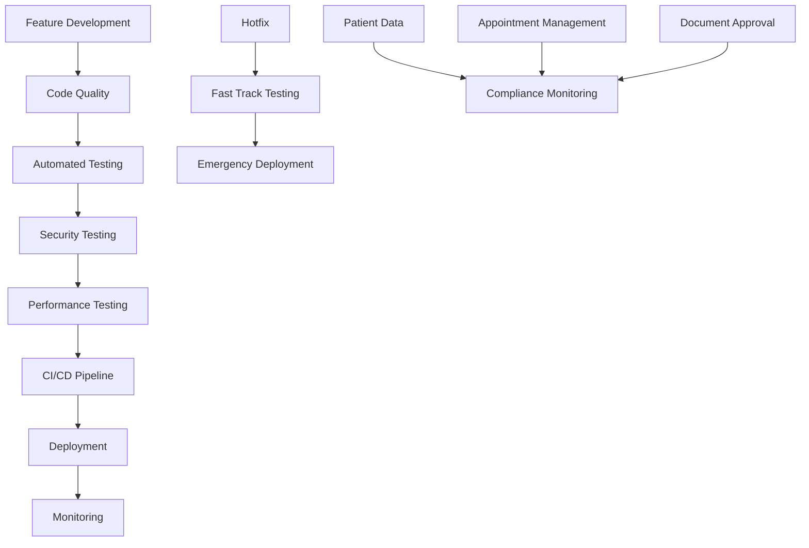

# HSC1 Development Workflows Configuration

HSC1 병원 관리 시스템의 개발 워크플로우 및 자동화 프로세스 정의

## 🔄 Workflow Architecture

### Workflow Categories
- **Development Workflows**: 개발 프로세스 자동화 (5개)
- **Testing Workflows**: 품질 보증 프로세스 (4개) 
- **Deployment Workflows**: 배포 및 운영 프로세스 (3개)
- **Business Workflows**: 비즈니스 프로세스 자동화 (4개)

---

## 💻 Development Workflows

### 1. Code Quality Workflow
```yaml
name: "code-quality-check"
trigger: 
  - "git push"
  - "pull request created"
description: "코드 품질 검사 및 표준 준수 확인"

steps:
  1_code_analysis:
    - name: "Rubocop Style Check"
      command: "bundle exec rubocop"
      fix_command: "bundle exec rubocop -a"
      failure_action: "block_merge"
      
    - name: "Brakeman Security Scan" 
      command: "bundle exec brakeman -q"
      output: "security_report.json"
      failure_action: "create_issue"
      
    - name: "Bundle Audit"
      command: "bundle audit"
      failure_action: "notify_team"

  2_code_complexity:
    - name: "Method Length Check"
      threshold: "15 lines"
      failure_action: "warning"
      
    - name: "Class Length Check" 
      threshold: "100 lines"
      failure_action: "warning"
      
    - name: "Cyclomatic Complexity"
      threshold: "10"
      failure_action: "review_required"

  3_documentation:
    - name: "API Documentation Update"
      check: "swagger/v1/swagger.yaml modified"
      required_when: "controller files changed"
      
    - name: "README Update Check"
      check: "significant changes require README update"
      threshold: "> 50 lines changed"

notifications:
  success: "slack://dev-team"
  failure: "email://team-leads"
```

### 2. Database Migration Workflow
```yaml
name: "database-migration"
trigger:
  - "db/migrate/ files added/modified"
description: "데이터베이스 마이그레이션 검증 및 적용"

steps:
  1_validation:
    - name: "Migration Syntax Check"
      command: "rails db:migrate:status"
      environment: "test"
      
    - name: "Rollback Test"
      command: "rails db:migrate && rails db:rollback"
      environment: "test"
      
    - name: "Data Loss Prevention"
      checks:
        - "drop_table detection"
        - "remove_column detection"
        - "foreign_key removal detection"
      action: "require_explicit_confirmation"

  2_testing:
    - name: "Test Database Migration"
      command: "rails db:migrate"
      environment: "test"
      
    - name: "Model Tests After Migration"
      command: "rails test test/models/"
      environment: "test"
      
    - name: "Integration Tests"
      command: "rails test test/integration/"
      environment: "test"

  3_documentation:
    - name: "Schema Documentation Update"
      check: "db/schema.rb changes documented"
      auto_generate: "entity_relationship_diagram"

notifications:
  migration_applied: "slack://dev-team"
  rollback_required: "email://dba-team"
```

### 3. Feature Development Workflow
```yaml
name: "feature-development"
trigger:
  - "feature branch created"
  - "feature/* branch push"
description: "기능 개발 표준 프로세스"

steps:
  1_planning:
    - name: "Feature Specification Check"
      required_files:
        - "feature_spec.md"
        - "api_contract.yml"
      location: "docs/features/"
      
    - name: "Test Cases Planning"
      template: "test_case_template.md"
      review_required: true

  2_development:
    - name: "TDD Compliance Check"
      rule: "test files must exist before implementation"
      check: |
        for model in $(git diff --name-only | grep 'app/models/'); do
          test_file="test/models/$(basename $model _test.rb).rb"
          [[ -f "$test_file" ]] || exit 1
        done
        
    - name: "API Contract Validation"
      tool: "rswag"
      command: "rails rswag:specs:swaggerize"
      
    - name: "Code Coverage Check"
      minimum: "80%"
      tool: "simplecov"

  3_review:
    - name: "Automated Review"
      checks:
        - "naming_conventions"
        - "rails_best_practices" 
        - "n_plus_one_queries"
        
    - name: "Security Review"
      focus_areas:
        - "sql_injection_prevention"
        - "xss_prevention"
        - "authentication_bypass"

integration:
  jira: "auto_create_subtasks"
  github: "auto_assign_reviewers"
  slack: "daily_progress_updates"
```

### 4. Hotfix Workflow
```yaml
name: "hotfix-deployment"
trigger:
  - "hotfix branch created"
  - "critical issue labeled"
description: "긴급 수정사항 신속 배포 프로세스"

steps:
  1_preparation:
    - name: "Issue Severity Validation"
      criteria:
        - "production_down"
        - "security_vulnerability"
        - "data_corruption_risk"
      approval_required: "tech_lead"
      
    - name: "Rollback Plan Creation" 
      required: true
      template: "rollback_plan_template.md"

  2_fast_track_testing:
    - name: "Critical Path Testing"
      focus: "affected functionality only"
      time_limit: "30 minutes"
      
    - name: "Security Scan"
      command: "bundle exec brakeman -q"
      required: true
      
    - name: "Smoke Tests"
      tests:
        - "authentication_works"
        - "database_accessible" 
        - "api_responses_200"

  3_deployment:
    - name: "Staging Deployment"
      environment: "staging"
      smoke_test: true
      
    - name: "Production Deployment"
      approval: "two_person_rule"
      rollback_timeout: "5 minutes"
      
    - name: "Post-Deployment Monitoring"
      duration: "1 hour"
      metrics: ["error_rate", "response_time", "success_rate"]

notifications:
  start: "all_hands"
  success: "team_leads"
  failure: "incident_response_team"
```

### 5. Refactoring Workflow
```yaml
name: "code-refactoring"
trigger:
  - "refactor label added"
  - "technical debt issue created"
description: "기술 부채 해소 및 코드 개선 프로세스"

steps:
  1_analysis:
    - name: "Code Metrics Collection"
      tools: ["flog", "flay", "rails_best_practices"]
      baseline: "pre_refactoring_metrics.json"
      
    - name: "Impact Assessment"
      check: |
        # 영향 받는 파일 및 기능 분석
        git diff --name-only | xargs grep -l "class\|module" | \
        xargs -I {} sh -c 'echo "=== {} ==="; grep -n "def " {}'

  2_refactoring:
    - name: "Test Coverage Verification"
      minimum: "95%"
      affected_code_only: true
      
    - name: "Behavior Preservation"
      strategy: "characterization_tests"
      tool: "mutant" # mutation testing
      
    - name: "Incremental Changes"
      rule: "max 10 files per commit"
      atomic_commits: true

  3_validation:
    - name: "Metrics Improvement Check"
      compare: "pre_refactoring_metrics.json"
      required_improvement: "20%"
      
    - name: "Performance Regression Test"
      benchmark: "before_and_after"
      acceptable_degradation: "5%"

documentation:
  - "refactoring_log.md"
  - "before_after_metrics.json"
  - "lessons_learned.md"
```

---

## 🧪 Testing Workflows

### 6. Automated Testing Workflow
```yaml
name: "automated-testing"
trigger:
  - "code push"
  - "scheduled: daily 2 AM"
description: "자동화된 테스트 실행 및 리포팅"

test_suites:
  unit_tests:
    command: "rails test test/models/ test/controllers/"
    parallel: true
    coverage: true
    timeout: "5 minutes"
    
  integration_tests:
    command: "rails test test/integration/"
    database: "test_integration"
    timeout: "10 minutes"
    
  system_tests:
    command: "rails test:system"
    browser: "headless_chrome"
    timeout: "15 minutes"
    screenshots: "on_failure"

performance_tests:
  - name: "API Load Test"
    tool: "ab" # Apache Bench
    endpoints:
      - "POST /api/v1/auth/login"
      - "GET /api/v1/patients"
      - "POST /api/v1/appointments"
    concurrent: 10
    requests: 1000
    
  - name: "Database Performance"
    queries: "slow_queries.sql"
    threshold: "100ms"

reporting:
  format: ["junit_xml", "html", "json"]
  store: "test_results/"
  history: "90_days"
  notifications:
    failure: "slack://dev-team"
    daily_summary: "email://team-leads"
```

### 7. Security Testing Workflow
```yaml
name: "security-testing"
trigger:
  - "security review requested"
  - "scheduled: weekly"
description: "보안 취약점 검사 및 침투 테스트"

static_analysis:
  - name: "Brakeman Scan"
    command: "bundle exec brakeman -o security_report.json"
    severity: ["high", "medium"]
    
  - name: "Bundle Audit"
    command: "bundle audit --update"
    action: "auto_update_safe_gems"
    
  - name: "Secret Detection"
    tool: "git-secrets"
    patterns:
      - "JWT_SECRET"
      - "password"
      - "api_key"

dynamic_testing:
  - name: "Authentication Testing"
    scenarios:
      - "brute_force_login"
      - "jwt_token_tampering"
      - "session_fixation"
      
  - name: "Authorization Testing" 
    scenarios:
      - "privilege_escalation"
      - "horizontal_access"
      - "vertical_access"
      
  - name: "Input Validation Testing"
    targets:
      - "sql_injection"
      - "xss_injection"
      - "command_injection"

compliance:
  - standard: "HIPAA"
    checks: ["data_encryption", "access_logs", "audit_trails"]
  - standard: "OWASP_Top_10"
    automated: true
    manual_review: "quarterly"

reporting:
  format: "security_report.pdf"
  distribution: ["cto", "security_team", "dev_leads"]
  retention: "1_year"
```

### 8. Performance Testing Workflow
```yaml
name: "performance-testing"
trigger:
  - "performance label added"
  - "scheduled: weekly"
description: "시스템 성능 측정 및 최적화"

load_testing:
  scenarios:
    normal_load:
      users: 50
      duration: "10 minutes"
      ramp_up: "2 minutes"
      
    peak_load:  
      users: 200
      duration: "30 minutes"
      ramp_up: "5 minutes"
      
    stress_test:
      users: 500
      duration: "10 minutes"
      ramp_up: "1 minute"

metrics:
  response_time:
    - percentile_95: "<500ms"
    - percentile_99: "<1000ms"
    - average: "<200ms"
    
  throughput:
    - requests_per_second: ">100"
    - concurrent_users: ">200"
    
  resources:
    - cpu_usage: "<80%"
    - memory_usage: "<1GB"
    - database_connections: "<50"

profiling:
  tools: ["rack-mini-profiler", "ruby-prof"]
  focus: ["memory_allocation", "n_plus_one_queries", "slow_methods"]
  reports: ["flamegraph", "call_stack", "memory_profile"]

optimization:
  triggers:
    - "response_time > threshold"
    - "memory_leak_detected"
    - "database_bottleneck"
  actions:
    - "auto_cache_warming"
    - "database_index_suggestion"
    - "code_optimization_hints"
```

### 9. Regression Testing Workflow
```yaml
name: "regression-testing"
trigger:
  - "release candidate created"
  - "major feature merged"
description: "회귀 테스트 및 기능 안정성 검증"

test_selection:
  strategy: "risk_based"
  criteria:
    - "recently_changed_code"
    - "high_business_value_features"
    - "previously_failed_tests"
    
critical_paths:
  - name: "Patient Registration Flow"
    tests: ["patient_creation", "validation_checks", "number_generation"]
    
  - name: "Appointment Booking Flow"  
    tests: ["slot_availability", "booking_confirmation", "conflict_detection"]
    
  - name: "Authentication Flow"
    tests: ["login", "token_refresh", "logout", "role_validation"]

automated_regression:
  test_data: "production_subset"
  environment: "staging_mirror"
  parallel_execution: true
  
visual_regression:
  tool: "percy"
  pages: ["login", "dashboard", "patient_list", "appointment_calendar"]
  browsers: ["chrome", "firefox", "safari"]

reporting:
  comparison: "previous_release"
  metrics: ["pass_rate", "new_failures", "performance_delta"]
  notification: "release_team"
```

---

## 🚀 Deployment Workflows

### 10. CI/CD Pipeline Workflow
```yaml
name: "ci-cd-pipeline"
trigger:
  - "main branch push"
  - "release tag created"
description: "지속적 통합 및 배포 파이프라인"

stages:
  build:
    - name: "Bundle Install"
      command: "bundle install --deployment"
      cache: "vendor/bundle"
      
    - name: "Asset Compilation"
      command: "rails assets:precompile"
      cache: "public/assets"
      
    - name: "Docker Image Build"
      dockerfile: "Dockerfile"
      tags: ["latest", "${COMMIT_SHA}"]

  test:
    parallel:
      - "Unit Tests"
      - "Integration Tests" 
      - "Security Scan"
      - "Code Quality Check"
    failure_action: "stop_pipeline"

  staging_deploy:
    environment: "staging"
    steps:
      - "database_migration"
      - "application_deployment"
      - "smoke_tests"
      - "integration_tests"
    approval: "automatic"

  production_deploy:
    environment: "production"
    strategy: "blue_green"
    steps:
      - "database_migration"
      - "zero_downtime_deployment"
      - "health_checks"
      - "traffic_switch"
    approval: "manual"
    rollback_timeout: "5_minutes"

notifications:
  deployment_started: "team_channel"
  deployment_success: "stakeholders"
  deployment_failed: "on_call_engineer"
```

### 11. Database Migration Workflow
```yaml
name: "production-migration"
trigger:
  - "migration files in release"
description: "프로덕션 데이터베이스 마이그레이션 안전 실행"

pre_migration:
  - name: "Backup Creation"
    command: "pg_dump hsc1_production > backup_$(date +%Y%m%d_%H%M%S).sql"
    retention: "30_days"
    
  - name: "Migration Analysis"
    checks:
      - "breaking_changes_detection"
      - "data_loss_risk_assessment"
      - "estimated_execution_time"
      
  - name: "Rollback Plan"
    required: true
    test: "staging_environment"

migration_execution:
  strategy: "zero_downtime"
  steps:
    - "read_only_mode_enable"
    - "migration_execute"
    - "data_validation"
    - "read_write_mode_restore"
    
  monitoring:
    - "connection_count"
    - "lock_duration" 
    - "query_performance"
    
  timeout: "30_minutes"
  
post_migration:
  - name: "Data Integrity Check"
    queries: "integrity_checks.sql"
    
  - name: "Performance Validation"
    baseline: "pre_migration_performance.json"
    acceptable_degradation: "10%"
    
  - name: "Application Health Check"
    duration: "15_minutes"
    rollback_trigger: "error_rate > 1%"
```

### 12. Monitoring & Alerting Workflow
```yaml
name: "monitoring-alerting"
trigger: "continuous"
description: "실시간 시스템 모니터링 및 알림"

metrics_collection:
  application:
    - "request_rate"
    - "response_time" 
    - "error_rate"
    - "active_users"
    
  infrastructure:
    - "cpu_utilization"
    - "memory_usage"
    - "disk_space"
    - "network_io"
    
  business:
    - "patient_registrations"
    - "appointment_bookings"
    - "system_availability"

alerting_rules:
  critical:
    - condition: "error_rate > 5%"
      notification: "pager_duty"
      escalation: "5_minutes"
      
    - condition: "response_time > 2000ms"
      notification: "slack_alert"
      escalation: "15_minutes"
      
    - condition: "database_down"
      notification: "immediate_call"
      escalation: "1_minute"

  warning:
    - condition: "cpu_usage > 80%"
      notification: "email"
      frequency: "hourly_digest"
      
    - condition: "disk_space < 20%"
      notification: "slack"
      frequency: "daily"

incident_response:
  severity_1: "production_down"
    - "auto_page_on_call"
    - "create_incident_channel"
    - "notify_stakeholders"
    
  severity_2: "performance_degradation"
    - "alert_dev_team"
    - "auto_scale_resources"
    - "monitor_trends"

dashboards:
  - "executive_summary"
  - "operational_metrics"
  - "business_kpis"
  - "technical_health"
```

---

## 🏥 Business Workflows

### 13. Patient Data Workflow
```yaml
name: "patient-data-management"
trigger:
  - "patient created/updated"
  - "scheduled: daily maintenance"
description: "환자 데이터 품질 관리 및 정리"

data_validation:
  - name: "Contact Information Validation"
    rules:
      - "phone_number_format"
      - "email_format_validation"
      - "address_completeness"
    auto_fix: "format_standardization"
    
  - name: "Medical Data Integrity"
    checks:
      - "birth_date_realistic"
      - "medical_history_consistency"
      - "appointment_date_validity"

data_enrichment:
  - name: "Insurance Verification"
    api: "insurance_provider_api"
    frequency: "monthly"
    
  - name: "Contact Update Verification"
    method: "sms_verification"
    trigger: "contact_change"

privacy_compliance:
  - name: "Data Retention Check"
    rules:
      - "inactive_patients > 7_years"
      - "deleted_appointments > 3_years"
    action: "archive_or_anonymize"
    
  - name: "Access Audit"
    log: "patient_data_access.log"
    report: "monthly_access_report.pdf"

automation:
  - "duplicate_detection"
  - "data_quality_scoring"
  - "privacy_impact_assessment"
```

### 14. Appointment Management Workflow
```yaml
name: "appointment-management"
trigger:
  - "appointment created/updated"
  - "scheduled: hourly optimization"
description: "예약 시스템 최적화 및 자동화"

scheduling_optimization:
  - name: "Slot Optimization"
    algorithm: "genetic_algorithm"
    factors:
      - "doctor_availability"
      - "patient_preference"
      - "travel_time"
      - "equipment_availability"
      
  - name: "Overbooking Management"
    strategy: "controlled_overbooking"
    no_show_rate: "historical_average"
    safety_margin: "10%"

automated_communication:
  - name: "Appointment Reminders"
    schedule:
      - "24_hours_before": "sms"
      - "2_hours_before": "phone_call"
    customization: "patient_preference"
    
  - name: "Waitlist Management"
    triggers:
      - "appointment_cancelled"
      - "new_slot_available"
    priority: "urgency_score"

conflict_resolution:
  - "double_booking_detection"
  - "resource_conflict_resolution"
  - "emergency_slot_allocation"
  
analytics:
  - "no_show_prediction"
  - "optimal_booking_patterns"
  - "resource_utilization_analysis"
```

### 15. Document Approval Workflow
```yaml
name: "document-approval-automation"
trigger:
  - "approval_requested"
  - "approver_unavailable"
description: "전자결재 프로세스 자동화"

workflow_routing:
  - name: "Smart Routing"
    rules:
      - document_type: "leave_request"
        approver: "direct_manager"
      - document_type: "purchase_order" 
        approver: "finance_manager"
      - amount: "> $1000"
        additional_approver: "department_head"

automated_approval:
  - name: "Rule-Based Approval"
    conditions:
      - "leave_request < 1_day AND available_days > 10"
      - "routine_purchase < $100"
    action: "auto_approve"
    audit: "approval_log.json"

escalation_management:
  - name: "Approval Timeout"
    timeout: "48_hours"
    action: "escalate_to_manager"
    
  - name: "Approver Unavailable"
    detection: "out_of_office_status"
    action: "delegate_to_deputy"

notifications:
  - "approval_request_sent"
  - "approval_received" 
  - "approval_expired"
  - "workflow_completed"

analytics:
  - "approval_time_analysis"
  - "bottleneck_identification"
  - "approval_pattern_mining"
```

### 16. Compliance Monitoring Workflow
```yaml
name: "compliance-monitoring"
trigger: "continuous"
description: "의료 규정 및 내부 정책 준수 모니터링"

regulatory_compliance:
  hipaa:
    - "patient_data_encryption_check"
    - "access_log_completeness"
    - "data_breach_detection"
    - "staff_training_verification"
    
  medical_device_regulation:
    - "equipment_calibration_schedule"
    - "maintenance_log_verification"
    - "safety_protocol_adherence"

internal_policy:
  - name: "Staff Working Hours"
    rule: "max_consecutive_hours <= 12"
    monitoring: "attendance_system"
    
  - name: "Patient Privacy"
    rule: "no_unauthorized_access"
    monitoring: "access_audit_trail"

automated_reporting:
  - frequency: "monthly"
    reports:
      - "hipaa_compliance_report"
      - "staff_compliance_summary"
      - "policy_violation_report"
    distribution: ["compliance_officer", "management"]

remediation:
  - "policy_violation_notification"
  - "training_requirement_assignment"
  - "corrective_action_tracking"
```

---

## 🎛️ Workflow Orchestration

### Workflow Dependencies


### Workflow Configuration Management
```yaml
global_settings:
  timeout: 
    default: "30_minutes"
    critical: "5_minutes"
    
  notifications:
    channels: ["slack", "email", "sms"]
    priorities: ["low", "medium", "high", "critical"]
    
  environments:
    - "development"
    - "testing" 
    - "staging"
    - "production"

workflow_engine:
  executor: "github_actions"
  backup: "jenkins"
  monitoring: "workflow_telemetry"
  
integration:
  issue_tracking: "jira"
  chat: "slack"  
  monitoring: "datadog"
  alerts: "pagerduty"
```

이러한 워크플로우 설정을 통해 HSC1 시스템의 개발부터 운영까지 전체 라이프사이클을 자동화하고 품질을 보장할 수 있습니다.